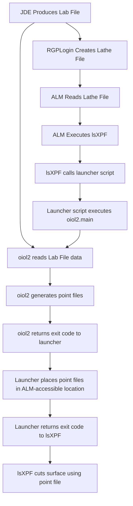

# Optimum Infinite Orthokeratology Lens II

## Overview

This project supports the production workflow for the **Optimum Infinite Orthokeratology Lens II** design at X-Cel Specialty Contacts.

The overall system is intended to:

1. Accept customer / ECP order inputs directly in **JD Edwards Configurator**
2. Generate the required production data in JDE, including the **Lab File** and **Invoice**
3. Generate DAC International ALM **point files** from JDE production data
4. Automatically invoke point-file generation during ALM job processing
5. Use a custom ALM manufacturing program (**LSID**) to cut lens surfaces from the generated point files
6. Support lathe-file generation through updates to **RGPLogin.exe**

This repository is primarily the source and documentation hub for the **`oiol2` point-file generator** and its integration into the broader manufacturing workflow.

---

## System Components

The complete production solution includes four major components:

1. **JD Edwards Configurator**
2. **`oiol2` Point File Generator**
3. **DAC ALM LSID (`lsXPF`)**
4. **RGPLogin.exe modifications**

Not all of these components are fully version-controlled in this repository. This repository focuses mainly on:

- the Python source code for `oiol2`
- launcher scripts used to invoke `oiol2`
- supporting configuration and data files
- tests
- documentation describing system integration

---

## Current Implementation Summary

### 1. JD Edwards Configurator

- A new item was created for this project: **Item 733**
- For Item 733, Customer Service enters the ECP's inputs directly into JDE Configurator
- No intermediate calculator / translator is required before entering order data into Configurator
- JDE produces a **Lab File** containing the data needed to generate lathe point files
- The invoice has been mocked up in the JDE **Test** environment
- Full testing of the invoice is still required before promotion to the **Live** environment

### 2. `oiol2` Point File Generator

`oiol2` is the Python program that reads production data and generates DAC ALM point files.

#### Original concept

The original plan was to host `oiol2` on a server and have the ALM call it remotely. In that design:

- the ALM would pass arguments identifying the lens/job to cut
- the server would generate the point files
- the server would return an exit code to the ALM
- the ALM would retrieve the generated point files and continue processing

This approach was not implemented due to credential, access, and IT support complexities between systems.

#### Implemented approach

The implemented solution runs `oiol2` **locally on the ALM PC**.

This avoids cross-system credential and server access issues. In the implemented design:

- the ALM PC runs a local 32-bit Python runtime
- `oiol2` is installed locally on the ALM PC
- the ALM invokes `oiol2` through a batch launcher
- `oiol2` generates the required point files locally
- the exit code is returned back to the ALM workflow

#### 32-bit runtime port

The development version of `oiol2` was originally built using:

- Python 3.11
- 64-bit Windows
- a Conda-based development environment

Because the ALM-connected PCs run **Windows 10 LTS 32-bit**, `oiol2` was ported to run under a standalone **Python 3.11 32-bit** installation.

Notes:

- `matplotlib` was removed from the ALM runtime path because plotting was only needed for development
- `numpy` required installation of the **Microsoft Visual C++ Redistributable**
- the 32-bit version was validated on the ALM-connected PC

#### Front-surface laser engraving

`oiol2` now includes the WO number as laser-writing data in the front-surface DAC point file.

The generated front point file uses the **`FRL`** format (front side, radial format, laser writing). The laser-writing block is written after the diagnostic-mark count and before the first surface definition.

For the current production configuration:

- the laser text is the WO number passed with `--wo`
- the engraving radius is calculated as `lens diameter / 2 - edge_offset_mm`
- the default engraving direction is **270.0 degrees**
- the default character height is **0.400 mm**
- the default character spacing factor is **1.0**
- the default edge offset is **0.400 mm**

The fixed laser-writing parameters are maintained in the `[laser_writing]` section of `lens_design.toml`, while the WO number and lens diameter are determined for each production job.

This implementation was tested successfully in the production ALM workflow.

### 3. DAC ALM LSID (`lsXPF`)

A new LSID named **`lsXPF`** was developed with John Vanover.

`lsXPF` is responsible for:

- processing the point files generated for the lens surface
- calling the `oiol2` launcher so point files can be generated when needed
- continuing the ALM cutting process after point files are available

### 4. RGPLogin.exe

The source for `RGPLogin.exe` is written in Microsoft VB.

This program was modified so that when a job is set up in production, it creates the appropriate **Lathe File** needed by the ALM workflow for this project.  Version 1.17 is required for this process.

---

## Process Flow



### Execution chain

**S1**
`D:\oiol2\call_oiol2_point_file_gen.bat --wo ###`

**E1**
`D:\Python32\python.exe -m oiol2.main --wo ###`

**S2**
`oiol2.main`

**L1**
`D:\oiol2\test_dacfiles\`

---

## Repository Purpose

This repository should contain the **source of truth** for the `oiol2` software and its deployment documentation.

It is intended to include:

* Python source code
* configuration templates
* supporting data files
* test code
* launcher scripts
* system documentation
* integration notes for JD Edwards, `lsXPF`, and `RGPLogin.exe`

It should **not** be used to store:

* machine-specific installed copies
* build artifacts
* virtual environments
* log files
* Python cache folders
* generated point files used only for testing or local runs

---

## Repository Layout

Planned / preferred layout:

```text
Optimum_Infinite_Orthokeratology_Lens_II/
│
├── README.md
├── .gitignore
├── pyproject.toml
├── pytest.ini
├── environment.yml
├── requirements.txt
├── requirements_win32.txt
├── requirements_32bit_runtime.txt
│
├── configs/
├── data/
├── docs/
├── scripts/
├── src/
│   └── oiol2/
├── tests/
├── examples/
└── archive/
```

### Key directories

* **`src/oiol2/`**
  Main Python package for point-file generation
* **`configs/`**
  Configuration templates and sample TOML files
* **`data/`**
  Lens design data and lookup/reference files
* **`scripts/`**
  Launcher and helper scripts used for ALM execution and testing
* **`tests/`**
  Automated tests for parser and geometry logic
* **`docs/`**
  Project documentation, architecture notes, deployment notes, and design references
* **`examples/`**
  Sample lab files, sample outputs, and example inputs/outputs as needed
* **`archive/`**
  Legacy or reference material retained for historical reasons but not part of the active runtime path

---

## Development vs Deployment

### Development environment

Development was originally performed using:

* Python 3.11
* 64-bit Windows
* Conda environment
* optional plotting for geometry/debug work

### Deployment environment

The ALM runtime environment uses:

* Windows 10 LTS 32-bit
* standalone Python 3.11 32-bit
* locally installed `oiol2`
* launcher batch script
* Microsoft Visual C++ Redistributable for `numpy`

---

## ALM Deployment Layout

Example deployment layout on the ALM PC:

```text
D:\
├── Python32\
└── OIOL2\
    ├── call_oiol2_point_file_gen.bat
    ├── configs\
    ├── data\
    ├── logs\
    ├── src\
    └── test_dacfiles\
```

This installed layout is documented for deployment purposes, but the installed copy itself should not be committed as a duplicate code tree in Git.

---

## Status

### Completed

- [X] Item 733 created in JD Edwards Configurator
- [X] Direct ECP input workflow established in Configurator
- [X] Lab File generation working in JDE
- [X] `oiol2` developed and working in development environment
- [X] `oiol2` ported to Python 3.11 32-bit runtime
- [X] local ALM execution model implemented
- [X] `lsXPF` LSID created to process point files and invoke `oiol2`
- [X] `RGPLogin.exe` modified to generate the required Lathe File
- [X] WO laser engraving integrated into the front-surface `FRL` point file
- [X] laser-writing implementation validated in production
- [X] complete invoice testing in JDE Test environment
- [X] move invoice changes to JDE Live environment after validation
- [X] Install `lsXPF` and `oiol2` on ALM03, ALM06, ALM07, and ALM08

### Open items

- [ ] create an `lsXPF` version for ALM01 and ALM02

---

## Runtime Notes

* Some Python modules (e.g., `numpy`, `sympy`) on the 32-bit ALM system require the **Microsoft Visual C++ Redistributable**
* plotting support was intentionally removed from the ALM runtime path
* machine-specific config files should not be committed to version control unless sanitized for reuse

---

## Notes

This repository documents a manufacturing integration effort that spans ERP configuration, production setup, ALM machine integration, and Python-based point-file generation. The Python code in this repository is only one part of the overall solution, but it is the primary software component maintained here.

---

## Maintainer

### [X-Cel Specialty Contacts](https://www.xcelspecialtycontacts.com/)

[Allen Gilliard](agilliar@xcelspecialtycontacts.com)
